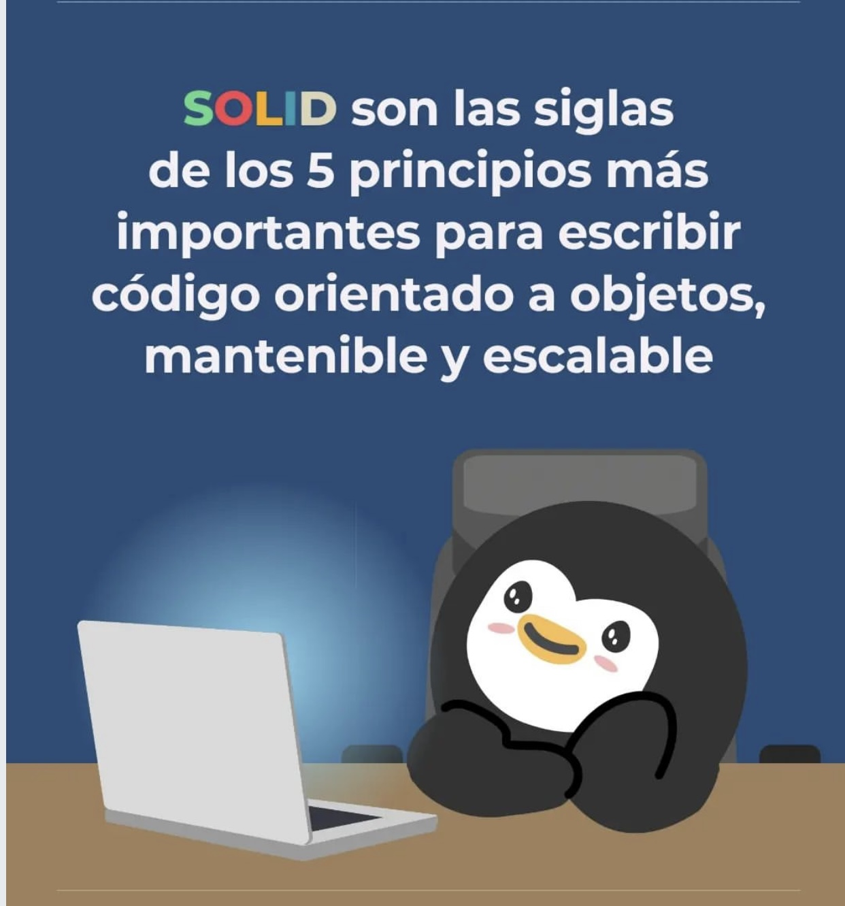

# Principios SOLID

  

La mayoria de patrones de diseño mencionados anteriormente, se basan en estos principios. 

Si estas trabajando con un lenguaje de POO te ayuda a hacer codigo escalable, mantenible, pero son mas SUGERENCIAS, donde si lo aplicas te ayudara a tener un codigo mas limpio. Utilizarlos de forma descuidada puede hacer mas mal que bien. Intenta ser siempre pragmático y no tomes todo esto como un dogma.

### Single Responsibility Principle
Principio de responsabilidad unica
[S >>](./single_responsability/SINGLE.md)

### Open/Closed Principle
Principio de abierto/cerrado
[O >>](./open_closed/OPENCLOSED.md)

### Liskov Substitution Principle
Principio de sustitucion de Liskov
[L >>](./liskov_substitution/LISKOV.md)

### Interface Segregation Principle
Principio de segregacion de la interfaz
[I >>](./interface_segregation/INTERFACES.md)

### Dependency Inversion Principle
Principio de inversion de la dependencia
[D >>](./dependency_inversion/DEPENDENCY.md)
